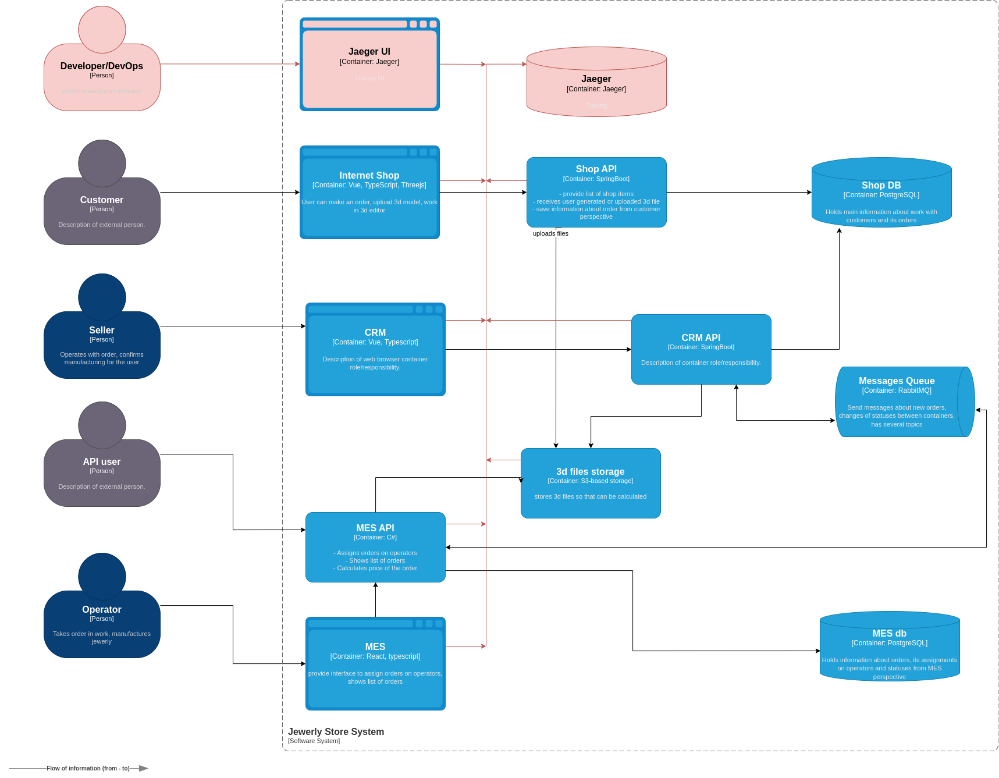

# Task3. "Архитектурное решение по трейсингу".

## Мотивация.

- Выявить проблемы с заказами в контексте.
- Выявить узкие места, влияющих на производительность запросов.
- Выявить ошибки в работе сервисов.
- Ускорится поиск и решение проблем.
- Повысится стабильность системы.

## Предлагаемое решение.

[Исходный код диаграммы предлагаемое решение](./jewerly_c4_model_task3.drawio)

## Компромиссы.

- На первом этапе можно привлечь аутсорс специальстов для настройки трейсинга, пока обучаются сотрудники или нанимается новый.
- Сложно заставить проприетарную систему отдавать метрики в нужном формате, может потребоваться дорогостоящая доработка. Если на первом этапе подключение разработки будет дорого - можно будет опустить. В будущем будет необходимо вернуться. Рефакторинг C# кода есть в полугодовом плане на этапе1.
- Связать систему трейсинга с логирование брокера сообщений, чтобы видеть полную картину одного заказа. Может быть сейчас не справляется брокер. На текущий момент, это можно будет выявить только по косвенным признакам и журналу брокера.

## Аспекты безопасности.

- Доступ Jaeger должны работать только из внутреннего контура. (Или через VPN в случае сильно распределенной команды).
- Необходима настройка аутентификации для доступа к Jaeger UI.
- Ограничить количество ролей имеющий доступ к Jaeger UI до "Developer" и "Dev/Ops".

## ❌ Дополнительное задание. 
