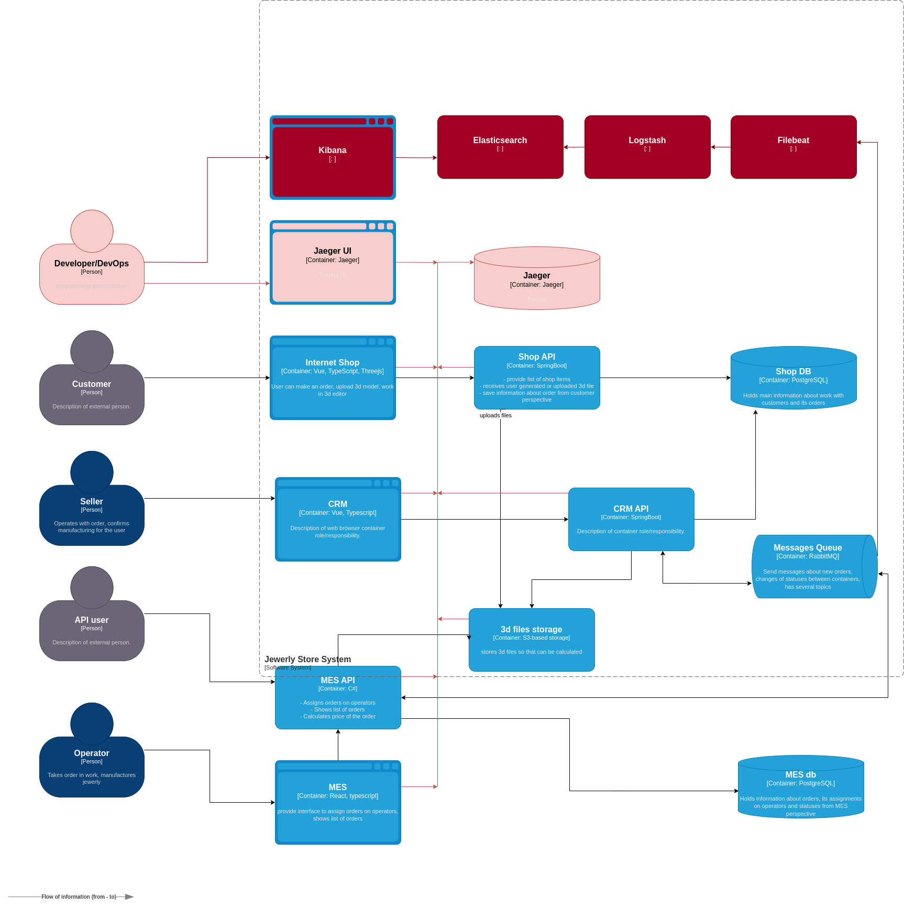

# Task4. "Архитектурное решение по логированию".

## Мотивация.

### Общая информация.

- Повышение стабильности системы.
- Ускорение обнаружения и решения проблем. В том числе и неожиданных.
- Повышение безопасности системы.
- Дополнительный источник информации для анализа проблем дополняющий логирование и трассировку.

### Метрики.

  - RabbitMQ
    - среднее время обработки сообщений.
    - максимальное время обработки сообщений.
  - CRM API
    - среднее/максимльное время обработки загрузки первой страницы.
    - RPS
  - MES API
    - среднее/максимльное время обработки обработки заказа.
    - RPS
  - Бизнес-метрики
    - среднее/максимльное время обработки заказа.
    - % процент потеряных заказов.
    - % роста заказов.
    - % роста пользоватей: клиенты/пользователи API.

### Приоритизация.

- RabbitMQ - в первую очередь, так как мы не можем покрыть трейсингом.
- MES API - так как есть проблемы в скорости работы и кэширование может решить проблему только в первое время. Также необходимо собрать метрики для рефакторинга.
- CRM API - сбор дополнительных метрик.

## Предлагаемое решение.

Планируеться использоваться схема мониторинга ELK:
- Filebeat - агрегация данных из разных источников.
- Elasticsearch – хранение и индексация.
- Logstash – обработка логов.
- Kibana – визуализация и анализ.

Примерное описание работы. Filebeat передаёт данные в Logstach — конвейер данных. Logstach передаёт данные в Elasticsearch — базу данных. Elasticsearch обменивается данными с Kibana, инструментом для визуализации.

### Схема 
[Исходный код диаграммы предлагаемое решение](./jewerly_c4_model_task4.drawio)

**Внимание!** Чтобы не перегружать схему, приведено состояние, только для первого этапа в приоритизации. В целевой картине все сервисы будут подключены к мониторингу через Filebeat.
Светло-красным обозначено решение предыдущего задания.
Темно-красным текущего.

### Политика безопасности в отношении логов

- Доступ Kibana должны работать только из внутреннего контура. (Или через VPN в случае сильно распределенной команды).
- Необходима настройка аутентификации для доступа к Kibana.
- Ограничить количество ролей имеющий доступ к Kibana до "Developer" и "Dev/Ops".

### Политику хранения

- FATAL — отказ сервиса или оборудования - 3 дня. Так как случаи их возникновения разработчики должны подключиться к решению проблем в течение суток.
- ERROR — ошибочное состояние. Например, «Пользователь заблокирован» - 1-2 недели. Так как нужно знать, что произошло с пользователем. Также может быть полезно для поддержки.
- WARN — состояние, которое близко к нестандартному поведению системы. Например, «Пользователь неправильно ввёл пароль». - 7 дня. Так как информация не имеет ценности.
- INFO — это штатное поведение. Такие логи обычно используют для записи обычных сообщений. Например, «Данные загружены». - 3 дня, так как могут потребоваться только для анализа проблем.
- DEBUG обычно используют для отладки. На продакшн-серверах их не используют, чтобы не засорять логи лишней информацией. - 3 дня. Нужно для FATAL ошибки.
- TRACE обычно используют в среде разработки и для отладки в тестовом окружении. - 3 дня. Нужно для FATAL ошибки.

**Речь идет только о хранение логов для разработки** метрики, которые нужны для бизнеса должны перемечаться в отдельную БД для хранения информации. И уже владелец процесса должен настраивать хранение на своей стороне, согласно бизнес процессам.

**Время политики хранения в дальнейшем можно откорректировать** Текущее время взято для уменьшения бюджета хранения, чтобы не было проблем с согласованием бюджета изменения. В будущем можно будет время увеличить, с масштабированием системы.

### Настройка алертов.
- на аномально высокое частоту запросов/заказов, чтобы избежать DDoS-атака
- на анамольно высокое количество ошибок и фатальных ошибок  (ERROR, FATAL) по отношению к поступившим запросам.

## ❌ Дополнительное задание. 
