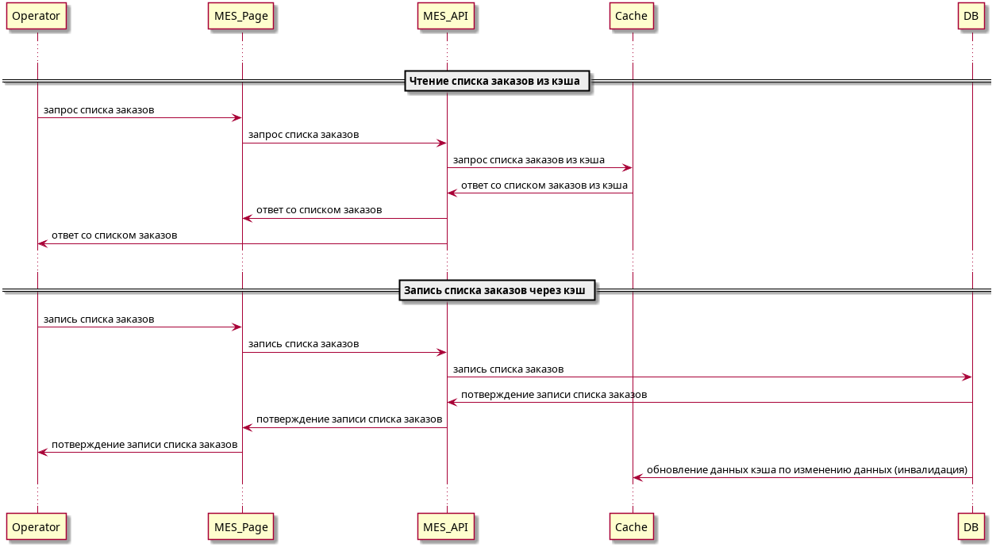

# Task5. "«Архитектурное решение по кешированию".

## Мотивация.

Внедрение кэширования необходимо, так как:
- Повысит производительности системы.
- Ускорения доступа к данным.
- Сокращения времени отклика системы.
- Уменьшения нагрузки на ресурсы.
- Положительно влияет на пользовательский опыт за счет ускорения загрузки данных.

Из-за больших изменений планируемых уже в системе на первом этапе требуется выполнить минимальное кэширование MES, так как на него уже поступали жалобы от операторов. В дальнейшем необходимо настроить кэширование и шардирование БД и других систем.

## Предлагаемое решение.
[Исходный код диаграммы последовательности действий](./jewerly_sequence_diagram_task5.puml)

Будем использовать серверное кэширование, так как на текущем этапе нет жалоб об медленной работе пользователей. А также данные на MES необходимо постоянно поддерживать в актуальное состояние.
Мы будем использовать паттерн Cache-Aside как самый простой и требующий меньше затрат на внедрение. При дальнейшем изменении системы мы можем перейти на другой паттерн.

Cтратегия инвалидации кеша:
- **Временная инвалидация**. Так как данные не измениются по времении переодически - не подойдет.
- **Инвалидация, основанная на запросах**. Не подойдет, так как обновление происходит по запросу. А оператору нужны актуальные данные.
- **Инвалидация на основе изменений**. Подойдет, так как данные обновляются только когда были изменения.
- **Программная инвалидация**. Позволяет гибко настраивать. Не подойдет на текущем этапе из-за плохой общеннсоти команды.
- **Инвалидация по ключу**. Позволяет изменить данные нужные к изменению. Может подойти как дополнительный вариант.

**Инвалидация, основанная на запросах** кажется лучшим выбором для первого этапа.

## ❌ Дополнительное задание. 
